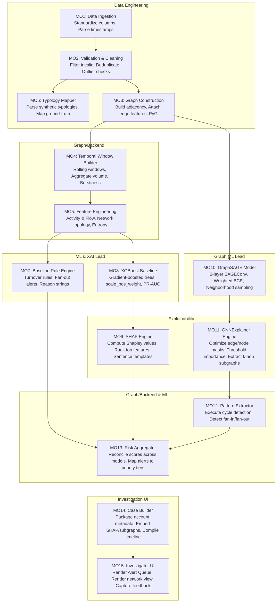

# GraphGuard: Explainable Detection of Suspicious Transaction Networks


**GraphGuard AML** is an explainable anti-money-laundering (AML) investigation system. It transforms streams of financial transactions into a transaction graph, identifies accounts or transaction groups exhibiting suspicious behavior, and presents an evidence-oriented explanation to a human investigator.

The system is intentionally **not** framed as an autonomous system that declares a customer is committing a crime. Its output is an **investigation risk signal** and an **explainable case** that helps an analyst decide what deserves further review.

---

## 🎯 The Central Project Question

> *Can graph-based machine learning identify suspicious transaction networks and produce compact, human-understandable explanations that help an AML investigator decide which alerts deserve deeper investigation?*

This is deliberately a **systems-and-evaluation question**, not a demand to invent a new GNN architecture. The novelty comes from the end-to-end investigation workflow:
1. Represent financial activity as a graph.
2. Model structural and temporal behavior.
3. Detect suspicious entities.
4. Explain the prediction using graph structure (GNNExplainer) and feature contributions (SHAP).
5. Turn explanations into a coherent investigation case.
6. Evaluate classification quality, explanation quality, and analyst usefulness.

---

## 🏗️ System Architecture & Workflow

The following Mermaid diagram illustrates the end-to-end data and modeling pipeline, mapping the 15 core modules to their respective engineering roles.



---

## ✨ Key Features

- **Graph-Based Detection:** Utilizes GraphSAGE to capture relational and structural information across accounts, moving beyond isolated tabular features.
- **Explainable AI (XAI):** Combines **SHAP** (feature-level importance) and **GNNExplainer** (subgraph-level importance) to provide a dual-layer explanation.
- **Pattern Extraction:** Automatically detects known money-laundering typologies (cycles, fan-in, fan-out) from the explanation subgraphs.
- **Investigator Dashboard:** A Streamlit-based UI that presents a prioritized alert queue, interactive transaction graphs, timelines, and human-readable evidence summaries.
- **Rigorous Evaluation:** Evaluates models using PR-AUC, Precision@K, and Recall@K to account for extreme class imbalance, alongside explanation fidelity and stability metrics.

---

## 📂 Repository Structure

```text
GraphGuard-AML/
│
├── README.md
├── requirements.txt
├── pyproject.toml
│
├── configs/                  # AMLSim and model configurations
├── data/                     # Raw, interim, and processed data
│
├── src/
│   ├── ingestion/            # Module 01 & 02: Data loading and validation
│   ├── graph/                # Module 03 & 04: Graph construction and temporal windows
│   ├── features/             # Module 05: Account and transaction feature engineering
│   ├── labels/               # Module 06: AMLSim ground-truth mapping
│   ├── baselines/            # Module 07 & 08: Rule engine and XGBoost
│   ├── gnn/                  # Module 10: GraphSAGE model and training
│   ├── explainability/       # Module 09 & 11: SHAP and GNNExplainer
│   ├── investigation/        # Module 12-14: Pattern detection, risk aggregation, case builder
│   └── utils/                # Logging, seeds, IO
│
├── dashboard/                # Module 15: Streamlit application
├── experiments/              # Configs, results, and reports
├── tests/                    # Unit and integration tests
└── docs/                     # Architecture and dataset documentation
```

---

## 🛠️ Technology Stack

- **Core:** Python, pandas, NumPy, NetworkX
- **Graph ML:** PyTorch, PyTorch Geometric (PyG)
- **Classical ML:** scikit-learn, XGBoost
- **Explainability:** SHAP, PyG's GNNExplainer
- **Frontend:** Streamlit, Plotly
- **Testing & Reproducibility:** pytest, Git

---

## 🚀 Getting Started

### 1. Environment Setup
```bash
git clone https://github.com/your-org/GraphGuard-AML.git
cd GraphGuard-AML
python -m venv venv
source venv/bin/activate  # On Windows: venv\Scripts\activate
pip install -r requirements.txt
```

### 2. Generate Synthetic Data
GraphGuard uses IBM AMLSim for synthetic data generation.
```bash
python scripts/generate_amlsim.py --config configs/amlsim_small.json
```

### 3. Run the Pipeline
Process the data, build the graph, and extract features:
```bash
python -m src.ingestion.load_transactions
python -m src.graph.build_graph
python -m src.features.account_features
```

### 4. Train Models
Train the XGBoost baseline and GraphSAGE model:
```bash
python -m src.baselines.xgboost_model
python -m src.gnn.train
```

### 5. Generate Explanations and Build Cases
```bash
python -m src.explainability.shap_explainer
python -m src.explainability.gnn_explainer
python -m src.investigation.case_builder
```

### 6. Launch the Investigator Dashboard
```bash
streamlit run dashboard/app.py
```

---

## 📊 Evaluation Metrics

Traditional accuracy is misleading for AML due to extreme class imbalance. We evaluate using:

- **Operational Metrics:** Precision, Recall, F1, PR-AUC, False-Positive Rate, Precision@K, Recall@K, Alert Workload Reduction.
- **Explanation Metrics:**
  - **Feature Overlap & Rank Correlation:** Stability of SHAP values.
  - **Fidelity/Faithfulness:** Impact of masking important features/edges.
  - **Sparsity:** Size of the explanation subgraph.
  - **Ground-Truth Overlap:** How well GNNExplainer subgraphs match known AMLSim patterns (e.g., cycles).

---

## 📅 12-Week Execution Plan (MVP)

| Phase | Weeks | Focus | Key Deliverable |
|---|---|---|---|
| **1** | 1-3 | Data & Graph | AMLSim setup, data pipeline, PyG graph construction. |
| **2** | 4-6 | Baselines & XAI | Rule engine, XGBoost, SHAP integration, initial dashboard. |
| **3** | 7-9 | GNN & Explanations | GraphSAGE training, GNNExplainer, pattern extraction. |
| **4** | 10-12 | Integration & Eval | Case builder, full Streamlit UI, ablations, final report. |

---

## 👥 Team Roles

- **Graph ML Lead:** GraphSAGE architecture, training pipeline, GNN experiments.
- **ML + XAI + Research Lead:** Feature engineering, XGBoost, SHAP, GNNExplainer, explanation metrics, research narrative.
- **Data Engineer:** AMLSim setup, cleaning, normalization, reproducibility scripts.
- **Graph/Backend Engineer:** Graph construction, pattern extraction, case builder API.
- **Frontend/QA/Integration:** Streamlit dashboard, visualization, end-to-end testing, documentation.

---

## 📚 Key References

This project builds upon foundational work in graph machine learning and AML research:

1. **Weber et al. (2018)** - *Scalable Graph Learning for Anti-Money Laundering: A First Look* ([arXiv:1812.00076](https://arxiv.org/abs/1812.00076))
2. **Eddin et al. (2021)** - *Anti-Money Laundering Alert Optimization Using Machine Learning with Graphs* ([arXiv:2112.07508](https://arxiv.org/abs/2112.07508))
3. **Cardoso et al. (2022)** - *LaundroGraph: Self-Supervised Graph Representation Learning for Anti-Money Laundering* ([arXiv:2210.14360](https://arxiv.org/abs/2210.14360))
4. **Hamilton et al. (2017)** - *Inductive Representation Learning on Large Graphs (GraphSAGE)* ([arXiv:1706.02216](https://arxiv.org/abs/1706.02216))
5. **Ying et al. (2019)** - *GNNExplainer: Generating Explanations for Graph Neural Networks* ([arXiv:1903.03894](https://arxiv.org/abs/1903.03894))
6. **Lundberg & Lee (2017)** - *A Unified Approach to Interpreting Model Predictions (SHAP)* ([arXiv:1705.07874](https://arxiv.org/abs/1705.07874))

---

## 📄 License

This project is licensed under the MIT License - see the [LICENSE](LICENSE) file for details.

## 🙏 Acknowledgments

- IBM for the [AMLSim](https://github.com/IBM/AMLSim) synthetic data generator.
- The PyTorch Geometric team for graph deep learning tooling.
- The open-source XAI community for SHAP and GNNExplainer implementations.
